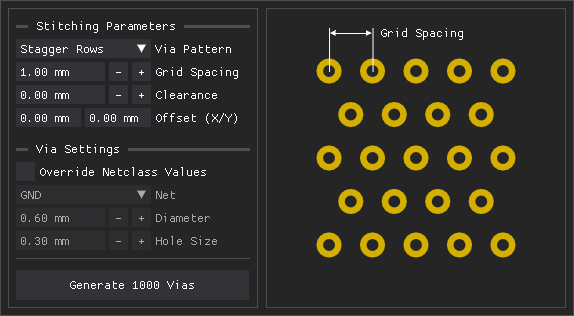

# Via Tools
[](https://github.com/narottamroyal/via-tools/actions/workflows/package.yml)

Automatically generate and manage via stitching patterns within copper zones and pads. This plugin stores stitching parameters for each zone and pad, allowing you to seamlessly update and regenerate stitched areas as your board layout evolves.

> [!IMPORTANT]
> **KiCad 10.0.1** or later is required. This plugin utilizes the modern KiCad API via [kicad-python](https://gitlab.com/kicad/code/kicad-python).



## Installation

- Download the packaged version of this plugin: [via-tools.zip](https://nightly.link/narottamroyal/via-tools/workflows/package/main/via-tools.zip)
- Launch the Plugin and Content Manager from the KiCad main menu
- Click `Install from File...` at the bottom of the window and select the downloaded `.zip` file
- If prompted to enable the KiCad API, select `Yes` 
- When you first open the PCB editor, it may take some time for the plugin icon to appear while dependencies are downloaded and installed in the background

### Troubleshooting

If the plugin icon does not appear:
- Go to `Preferences ► Plugins` and ensure `Enable KiCad API` is checked
- Restart KiCad
- Enable tracing for the IPC API: [developer documentation](https://dev-docs.kicad.org/en/apis-and-binding/ipc-api/for-addon-developers/index.html#_debugging)

## Development

Ensure that the required software is installed:
- [KiCad](https://www.kicad.org/download/)
- [uv](https://docs.astral.sh/uv/getting-started/installation/)

To test this plugin during development:
- Open the KiCad PCB editor (ensure the KiCad API is enabled)
- Clone [this repository](https://github.com/narottamroyal/via-tools)
- Open the repository in a terminal and run:
    ```bash
    uv run via-tools
    ```

### Packaging

The plugin can be packaged with the provided script:
```bash
uv run scripts/package.py
```

This packaging script:
- Generates PNG and ICO icons from the SVG icon
- Generates a `requirements.txt` file using `uv export`
- Uses the version specified in `pyproject.toml` to:
    - Generate a `_version.py` file
    - Update the `metadata.json` version
- Creates a `via-tools.zip` file with the required plugin folder structure